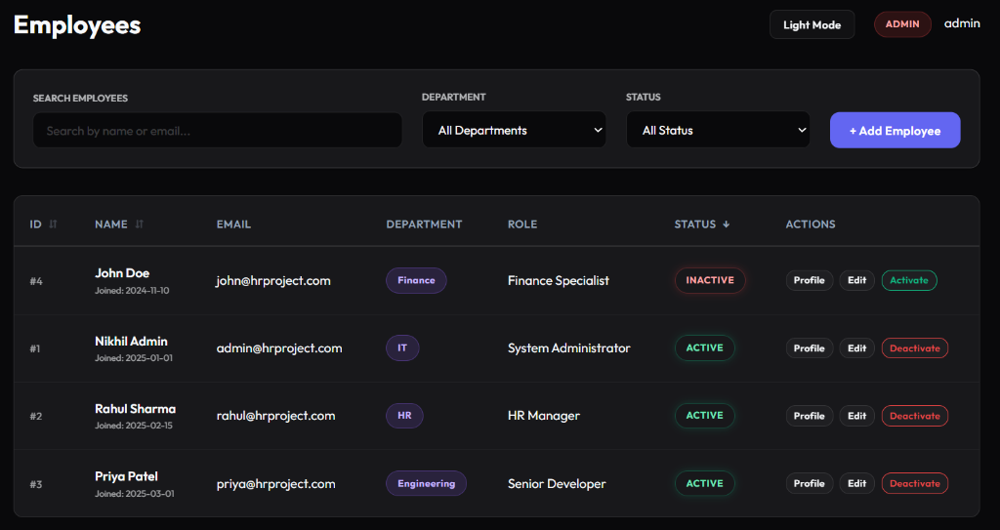

# PaySphere - HR Management System 🚀


## 📖 What the Project Does
**PaySphere** is a modern, comprehensive Full-Stack Human Resources Management System (HRMS). It streamlines core HR processes including employee directory management, real-time attendance tracking, payroll processing, and leave management. Designed with a sleek, dark-mode-first glassmorphism UI, it provides role-based access to ensure data security and ease of use for Admins, HR personnel, and Employees.

## 🛠️ Tech Stack
**Frontend:**
*   **React 19** - UI Library
*   **Vite** - Lightning-fast build tool
*   **CSS3** - Custom styling (Glassmorphism & Dark Mode)
*   **Supabase** - Client integration

**Backend:**
*   **Java 21** - Core language
*   **Spring Boot 3.2** - Backend framework
*   **Spring Security** - Authentication & Authorization
*   **Spring Data JPA** - Database ORM

**Database & Infrastructure:**
*   **H2 Database** - In-memory DB for rapid local development
*   **PostgreSQL (Supabase)** - Production database
*   **Docker & Docker Compose** - Containerization & Orchestration

## ✨ Features
*   **Role-Based Access Control (RBAC):** Distinct dashboards and permissions for `ADMIN`, `HR`, and standard `EMPLOYEE` roles.
*   **Employee Lifecycle Management:** Onboard, edit, and toggle employee status (Activate/Deactivate).
*   **Global Payroll Processing:** Process salaries, track net pay, and view historical payroll records across different currencies.
*   **Time & Attendance:** Real-time clock-in/clock-out functionality and remote work tracking.
*   **Leave Management:** Submit, review, and track vacation, sick, and personal leave requests.
*   **Interactive Dashboards:** High-level metrics for total headcount, pending tasks, and net payroll.

## 🏗️ Architecture / Design Overview
PaySphere follows a standard **Client-Server Architecture**:
*   **Client (hr-frontend):** A Single Page Application (SPA) built with React. It communicates asynchronously with the backend via RESTful APIs.
*   **Server (hr-backend):** A stateless Spring Boot REST API. It handles business logic, enforces security rules (CORS, Basic Auth, Method Security), and interacts with the database.
*   **Data Layer:** Abstraction via Hibernate/JPA, allowing seamless switching between the local H2 database for testing and a robust PostgreSQL instance for production.

## 📋 Prerequisites
To run this project locally, you will need:
*   **Git**
*   **Docker & Docker Desktop** (Recommended for easiest setup)

*If running manually without Docker:*
*   Node.js (v20+)
*   Java Development Kit (JDK 21+)

## 🚀 Installation / Setup

1. **Clone the repository:**
   ```bash
   git clone https://github.com/YourUsername/paysphere.git
   cd paysphere
   ```

2. **Environment Variables:**
   *Create a `.env` file inside the `hr-frontend` directory with your Supabase credentials (if testing production DB):*
   ```env
   VITE_SUPABASE_URL=your_supabase_url
   VITE_SUPABASE_ANON_KEY=your_supabase_anon_key
   ```
   *Note: For local development, the backend automatically defaults to the in-memory H2 database, requiring no extra DB setup.*

## 🐳 How to Run It (Using Docker)
The absolute easiest way to run the entire stack is using Docker Compose.

1. Ensure Docker Desktop is running.
2. From the root directory (`paysphere`), run:
   ```bash
   docker-compose up -d --build
   ```
3. **Access the Application:**
   *   Frontend: `http://localhost:5173`
   *   Backend API: `http://localhost:8080`

*Log in using the default admin credentials (Username: `admin` / Password: `admin`).*

## 🧪 How to Test It
**Manual UI Testing:**
1. Log in as `admin`.
2. Navigate to the **Employees** tab.
3. Test the "Deactivate" and "Reactivate" toggle on an employee (e.g., John Doe).
4. Verify the UI badge color changes and the status updates in the filter dropdown.

**Backend Unit Tests:**
Navigate to the backend directory and use Maven to run the test suite:
```bash
cd hr-backend
./mvnw test
```

## ⚙️ Configuration / Environment Variables
| Variable | Location | Description |
| :--- | :--- | :--- |
| `SPRING_PROFILES_ACTIVE` | `docker-compose.yml` | Sets backend profile. Use `dev` for local H2 DB, or `prod` for PostgreSQL. |
| `VITE_SUPABASE_URL` | `hr-frontend/.env` | The URL of your Supabase project. |
| `VITE_SUPABASE_ANON_KEY` | `hr-frontend/.env` | The public anon key for Supabase. |

## 📸 Screenshots



## 🔌 API Documentation (Overview)
The backend exposes a REST API secured by Spring Security.
*   `GET /api/employees` - Retrieve all employees.
*   `GET /api/employees/search` - Paginated search and filter for employees.
*   `POST /api/employees` - Create a new employee.
*   `PATCH /api/employees/{id}/status` - Activate/Deactivate an employee.
*   `POST /api/payroll/process` - Generate a payroll record for an employee.
*   `POST /api/attendance/clock-in` - Clock in the current user.

## 🚧 Known Limitations / Future Improvements
*   **Authentication:** Currently utilizing Basic Authentication. Future iterations will migrate to robust JWT (JSON Web Tokens) or OAuth2 via Supabase Auth.
*   **Testing Coverage:** Increase unit and integration test coverage for the React frontend using Jest/React Testing Library.
*   **Email Notifications:** Integrate SendGrid or AWS SES to automatically email employees their payroll slips and leave approvals.
*   **File Uploads:** Connect the Document module to AWS S3 or Supabase Storage for storing employee identity documents and contracts securely.
